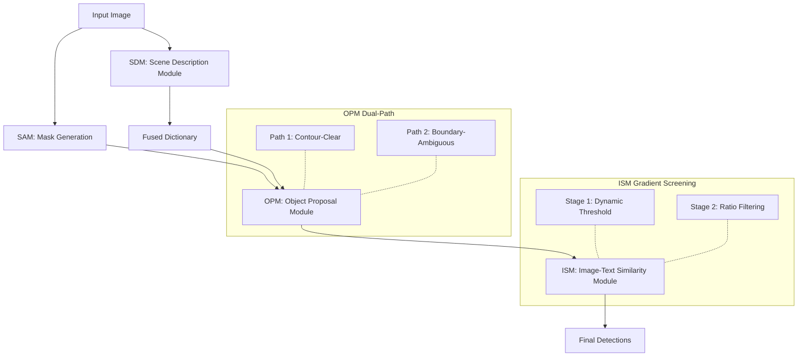

<div align="center">

# 🛰️ KGCS: Zero-Annotation Expert-Knowledge Injection for Object Detection in Aerial Images

[](https://doi.org/10.1109/TGRS.2026.3670221)
[](https://opensource.org/licenses/MIT)


📄 **Paper**: [IEEE Trans. Geosci. Remote Sens. 2026](https://doi.org/10.1109/TGRS.2026.3670221)

</div>

**K**nowledge-**G**uided **C**ollaborative **S**ystem (**KGCS**) is a **zero-annotation framework** for object detection in aerial images. By injecting structured expert knowledge into frozen foundation models (SAM, CLIP, GPT-4o), KGCS achieves competitive detection performance **without any training data or manual labels**.

---

## 📌 Highlights

| 🚫 **Zero Annotation** | 🧠 **Expert Knowledge** | 🤖 **Foundation Models** | 🧩 **Modular Pipeline** |
|:---:|:---:|:---:|:---:|
| No training data or labels | Bridges domain gaps in aerial imagery | SAM + CLIP + GPT-4o | Interpretable three-stage design |

---

## 🏗 Architecture



### 1. 📖 Scene Description Module (SDM)
- **Target dictionary** `D_target`: 20 DIOR categories with expert descriptions
- **Distractor dictionary** `D_distractor`: 10 common distractors
- **Contour dictionary** `D_contour`: 5 geometric prototypes
- **Fused dictionary**: Max 5 entries for CLIP efficiency
- **Optional GPT-4o one-shot parsing**

### 2. 🎯 Object Proposal Module (OPM)

| Path | Target | Strategy |
|:----:|--------|----------|
| **1** | Contour-clear (ships, vehicles...) | Mask→bbox + CLIP shape validation Eq.(4) |
| **2** | Boundary-ambiguous (harbors, stadiums...) | Mask clustering Eq.(5) + Adaptive windows Eq.(6–8) |

### 3. 🔍 Image-Text Similarity Module (ISM)
Two-stage **gradient screening**:
- **Stage 1** (Eq.11–13): `T_dynamic = μ − σ_factor × σ`
- **Stage 2** (Eq.14–15): Boundary-type-aware ratio filtering

---

## 🗂️ Project Structure

```
KGCS/
├── config/
│   └── settings.py              # All parameters & thresholds
├── core/
│   ├── sdm.py                   # 📖 Scene Description Module
│   ├── opm.py                   # 🎯 Object Proposal Module
│   ├── ism.py                   # 🔍 Image-Text Similarity Module
│   ├── pipeline.py              # 🔗 Pipeline orchestrator
│   └── __init__.py
├── utils/
│   └── obj_judge.py             # GPT-4o API wrapper (optional)
├── test_images/                 # Sample images
├── main_kgcs.py                 # 🚀 Single entry point
├── test_kgcs.py                 # Verification tests
├── README.md
├── requirements.txt
├── environment.yml
├── setup.py
├── LICENSE
└── .gitignore
```

---

## 🚀 Quick Start

### 1. Clone & Setup

```bash
git clone https://github.com/HSH55/KGCS.git
cd KGCS

# Conda
conda env create -f environment.yml
conda activate kgcs

# Or pip
pip install -r requirements.txt
pip install git+https://github.com/openai/CLIP.git
pip install git+https://github.com/facebookresearch/segment-anything.git
```

### 2. Download SAM Checkpoint

```bash
wget https://dl.fbaipublicfiles.com/segment_anything/sam_vit_h_4b8939.pth -O sam_vit_h.pth
```

### 3. Run Detection

```bash
# Single image
python main_kgcs.py --image test_images/11907.jpg --category ship

# Batch
python main_kgcs.py --folder /path/to/images --category airplane --max 10

# Evaluation (DIOR)
python main_kgcs.py --eval --category ship --gt /path/to/gt
```

### 4. Run Tests

```bash
python test_kgcs.py --test all
python test_kgcs.py --test pipeline --category ship
```

### 5. Python API

```python
from core.pipeline import KGCS_Pipeline

pipeline = KGCS_Pipeline(target_category="ship", output_base="./results")
result = pipeline.detect_image("image.jpg")
print(f"Found {result['n_final']} objects")
```

---

## 🔧 Supported Categories (20 DIOR)

| Fixed Boundary (Path 1) | Non-Fixed Boundary (Path 2) |
|------------------------|----------------------------|
| airplane, baseballfield, bridge, chimney, Expressway-toll-station, groundtrackfield, **ship**, storagetank, tenniscourt, vehicle, windmill | airport, basketballcourt, dam, Expressway-Service-area, golffield, harbor, overpass, stadium, trainstation |

---

## 📊 Experimental Results

| Dataset | Setting | Recall@100 | mAP |
|---------|---------|:----------:|:---:|
| DIOR | Novel classes | **42.9%** | **8.4%** |
| DIOR | All classes | **48.8%** | **15.4%** |
| DOTA | Novel classes | **52.6%** | **5.3%** |
| DOTA | All classes | **51.0%** | **5.4%** |

---

## 📄 Citation

```bibtex
@ARTICLE{11419164,
  author={Hu, Wei and Hu, Suhang and Ma, Fei and Zhao, Qihao and Zhang, Fan},
  journal={IEEE Trans. Geosci. Remote Sens.},
  title={KGCS: Zero-Annotation Expert-Knowledge Injection for Object Detection in Aerial Images},
  year={2026},
  volume={64},
  pages={1-16},
  doi={10.1109/TGRS.2026.3670221}
}
```

---

## 📄 License & Acknowledgments

**MIT License** — see [LICENSE](LICENSE) for details.

Built on [SAM](https://github.com/facebookresearch/segment-anything), [CLIP](https://github.com/openai/CLIP), [GPT-4o](https://openai.com/).

---

<div align="center">⭐ **If you find this useful, please star the repo!**</div>
